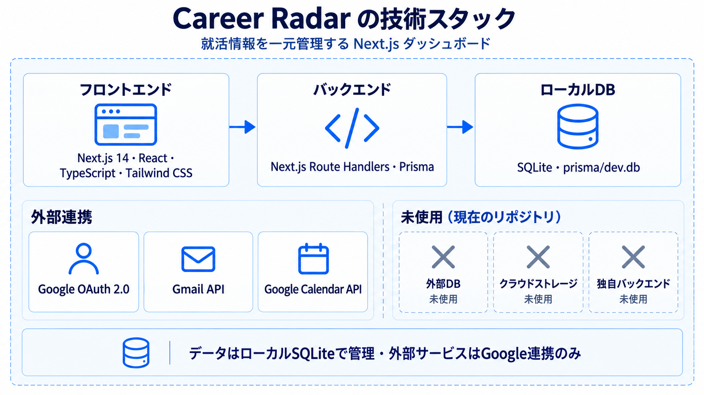

# Career Radar

学生の就職活動で散らばりがちな企業情報・メール・締切を、一つの画面で把握するためのダッシュボードです。個人開発として、技育CAMPハッカソンで制作しました。

[ポートフォリオ](https://myhomepage-neon.vercel.app) · [技術スタック](#技術スタック) · [セットアップ](#ローカルで起動する)

## 受賞

**サポーターズ賞 — 技育CAMPハッカソン 2026年度 Vol.2**

Career Radar を個人で開発し、株式会社サポーターズによるサポーターズ賞を受賞しました。

## できること

- Gmail の企業メールを取り込み、就活タスクとして整理
- Google Calendar に応募締切をワンクリックで追加
- 締切までの残り時間をリング型カウントダウンで可視化
- 企業情報を並べて比較
- ニュースや企業投稿を集約し、確認漏れを減らす

## 技術スタック



| 区分 | 実際に使用している技術 | 役割 |
| --- | --- | --- |
| フロントエンド | Next.js 14 / React / TypeScript / Tailwind CSS | 画面表示・操作・ダッシュボードUI |
| バックエンド | Next.js Route Handlers / Prisma | API・データ処理 |
| データベース | SQLite (`prisma/dev.db`) | ローカルでのデータ保存 |
| 外部連携 | Google OAuth 2.0 / Gmail API / Google Calendar API / GNews API | 認証・メール・予定・ニュースの連携 |

### 使っていないもの

このリポジトリの現行実装では、外部 PostgreSQL / Supabase、クラウドストレージ、独立したバックエンドサーバーは使用していません。データはローカルの SQLite に保存し、外部サービスとの連携は Google API などに限定しています。

## ローカルで起動する

```bash
git clone https://github.com/ryo-n-dayo/Career_Radar.git
cd Career_Radar
npm install
cp .env.example .env
npx prisma migrate dev
npm run dev
```

ブラウザで `http://localhost:3000` を開きます。

## 環境変数

`.env.example` を `.env` にコピーし、必要な値だけを設定します。

| 変数 | 用途 |
| --- | --- |
| `GOOGLE_CLIENT_ID` / `GOOGLE_CLIENT_SECRET` | Google OAuth の認証情報 |
| `GOOGLE_CALLBACK_URL` | OAuth のリダイレクト先 |
| `GNEWS_API_KEY` | ニュース取得 |
| `ANTHROPIC_API_KEY` / `OPENAI_API_KEY` | 任意の AI 要約機能 |
| `CRON_SECRET` | Vercel Cron の保護 |
| `NEXT_PUBLIC_DEMO_USER_ID` | 任意のデモ用ユーザー ID |

実際の API キー、OAuth シークレット、ローカルDB、ビルド生成物は GitHub にコミットしません。

## リンク

- [ポートフォリオ](https://myhomepage-neon.vercel.app)
- [App Store — Gymgrind](https://apps.apple.com/jp/app/gymgrind/id6790394636?l=en-US)

## License

Private / All rights reserved.
